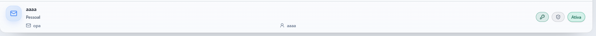

# Contas.exe

Cofre de credenciais para equipes, com login individual, permissões por papel,
auditoria, 2FA e criptografia em repouso para dados sensíveis.


## Visão geral

O `Contas.exe` organiza contas de redes sociais em grupos, com isolamento entre
usuários, sessão server-side, trilha de auditoria e proteção explícita para
segredos como senhas, e-mails de recuperação e tokens OAuth.

O projeto roda como um único serviço Node:

- a API serve `/api/*`
- o mesmo servidor entrega o frontend buildado
- o frontend usa fetch relativo, sem depender de uma URL separada de API

Hoje a arquitetura prioriza **PostgreSQL como persistência principal**, com
fallback legado para JSON em cenários locais ou migrações antigas.

## Preview

Visual real do cofre após a última limpeza visual do card:



## Principais capacidades

- Login por usuário com sessão server-side em cookie `HttpOnly`
- Papéis `superadmin`, `admin` e `member`
- Ownership por grupo: membro vê só o que é dele
- 2FA opcional por TOTP com códigos de recuperação
- Reautenticação para ações críticas
- Criptografia em repouso com `AES-256-GCM`
- Auditoria de ações sensíveis sem gravar segredos
- Busca, filtros e status das contas
- Busca global entre grupos
- Dashboard com visão geral por status e plataforma
- Painel administrativo dedicado para `superadmin`
- Gestão de usuários, sessões, segurança, auditoria e dados
- Configurações da conta com avatar, idioma, tema, sessões e conexões
- Recuperação e reset de senha
- Login social com Google e GitHub
- Fluxo de publicação/social poster com base pronta para YouTube e programação
- Export e import de grupos
- Backup completo administrativo
- Interface multilíngue: `pt`, `en`, `es`, `fr`, `zh`
- Tema visual próprio e componentes reutilizáveis
- Integrações OAuth para Google, GitHub e YouTube

## O que já está forte no produto

- Cofre multiusuário com isolamento real entre membros
- Reautenticação para revelar/copiar senha e outras ações sensíveis
- 2FA por TOTP com recovery codes
- Auditoria persistente das ações críticas
- Sessões revogáveis e controles de segurança server-side
- Base já preparada para operação em produção com Docker e Railway
- Documentação técnica, operacional e de segurança dentro do repositório

## Stack

| Camada | Tecnologia |
| --- | --- |
| Frontend | React 18, TypeScript, Vite 6, Tailwind CSS 3 |
| UI | componentes próprios em `src/components/ui`, Lucide React |
| Backend | Node.js HTTP nativo, sem framework |
| Persistência | PostgreSQL por padrão, fallback legado em JSON |
| Segurança | `crypto` nativo, `scrypt`, `AES-256-GCM`, TOTP |
| Deploy | Docker multi-stage, Railway-ready |
| Integrações | Google OAuth, GitHub OAuth, YouTube |

## Arquitetura

```text
Browser (React SPA)
  -> /api/*
Node server
  -> auth
  -> sessions
  -> permissions
  -> audit
  -> domain modules
  -> integrations
  -> PostgreSQL
      fallback: JSON storage legado
```

Decisões centrais:

- Um serviço só para simplificar deploy e operação
- Regras de acesso no servidor, nunca só no frontend
- Segredos protegidos na borda de I/O
- Persistência tratada como parte da arquitetura, não detalhe
- Documentação operacional junto do código

## Estrutura do repositório

```text
src/
  admin/                 # painel administrativo
  components/            # telas e blocos principais
  components/ui/         # primitives reutilizáveis
  data/                  # tipos e catálogos do domínio
  lib/                   # helpers e hooks
  locales/               # traduções

server/
  index.mjs              # entrypoint HTTP
  db.mjs                 # conexão PostgreSQL
  users-pg.mjs           # usuários e auth em SQL
  sessions.mjs           # sessões server-side
  audit.mjs              # trilha de auditoria
  crypto.mjs             # criptografia em repouso
  rate-limit.mjs         # proteção de login/reauth
  schema.sql             # schema principal
  youtube.mjs            # integração YouTube

scripts/
  local-dev.mjs          # sobe API + frontend
  scan-secrets.mjs       # varredura de segredos
  migrate-json-to-pg.mjs # migração legado -> PostgreSQL

tests/
  *.test.mjs             # testes de isolamento, sessão, rate limit etc.

docs/
  ARQUITETURA.md
  DEPLOY.md
  LGPD.md
  YOUTUBE.md
  SYSTEM-DESIGN-BASE.md
```

## Desenvolvimento local

Pré-requisitos:

- Node `>=20`
- PostgreSQL local se quiser rodar no modo principal

Instalação:

```bash
npm install
cp .env.example .env
npm run local
```

Scripts principais:

```bash
npm run local      # API + Vite
npm run dev        # só frontend
npm run api        # só backend
npm run typecheck  # TypeScript
npm run test       # testes Node
npm run build      # build de produção
npm run format     # Prettier
```

## Segurança

Pontos que definem o projeto:

- Senhas de usuários com `scrypt`
- Segredos de negócio cifrados em repouso
- Sessão revogável no servidor
- `SameSite=Strict` e `Secure` em HTTPS
- Rate limit de login e reauth
- Auditoria para ações críticas
- Backup tratado como dado sensível
- `scan-secrets` antes de build

Arquivos e dados sensíveis nunca devem ser commitados:

- `.env`
- `storage/*`
- backups exportados
- credenciais OAuth
- chaves privadas

Veja [SECURITY.md](SECURITY.md).

## Estado atual da persistência

O projeto está em transição consciente:

- **modo preferido:** PostgreSQL
- **modo legado:** JSON em `storage/`

Se o banco não estiver configurado, o servidor ainda consegue cair no modo
legado para manter compatibilidade com bases antigas. Para novos ambientes, o
padrão recomendado é PostgreSQL desde o início.

## Documentação

- [docs/ARQUITETURA.md](docs/ARQUITETURA.md): desenho técnico do sistema
- [docs/DEPLOY.md](docs/DEPLOY.md): produção e operação
- [docs/LGPD.md](docs/LGPD.md): privacidade e governança
- [docs/YOUTUBE.md](docs/YOUTUBE.md): integração YouTube
- [docs/SYSTEM-DESIGN-BASE.md](docs/SYSTEM-DESIGN-BASE.md): template pessoal de system design
- [SECURITY.md](SECURITY.md): segurança do repositório
- [IA.md](IA.md): contexto rápido para desenvolvimento

## Direção de design do projeto

O `Contas.exe` consolidou um estilo de arquitetura:

- monólito modular
- frontend forte, backend pragmático
- segurança séria desde o início
- deploy simples
- documentação operacional versionada

Esse padrão foi documentado em
[docs/SYSTEM-DESIGN-BASE.md](docs/SYSTEM-DESIGN-BASE.md) para reaproveitamento
em projetos futuros.
